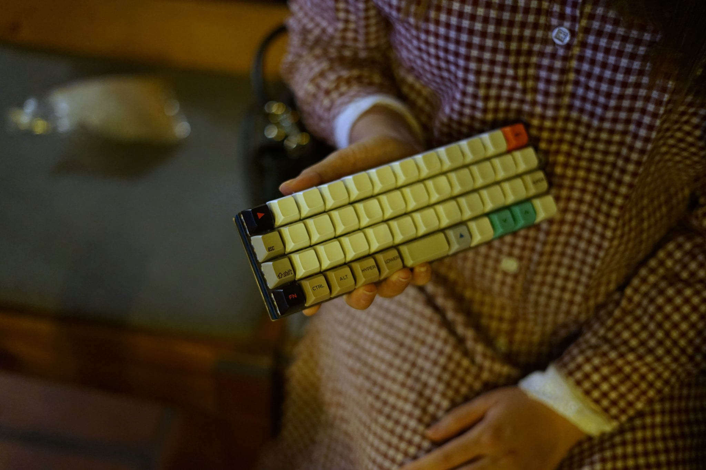
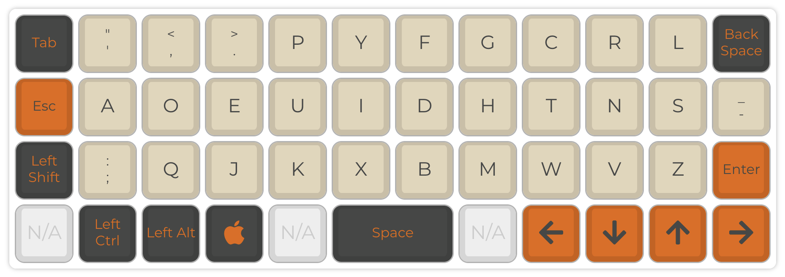
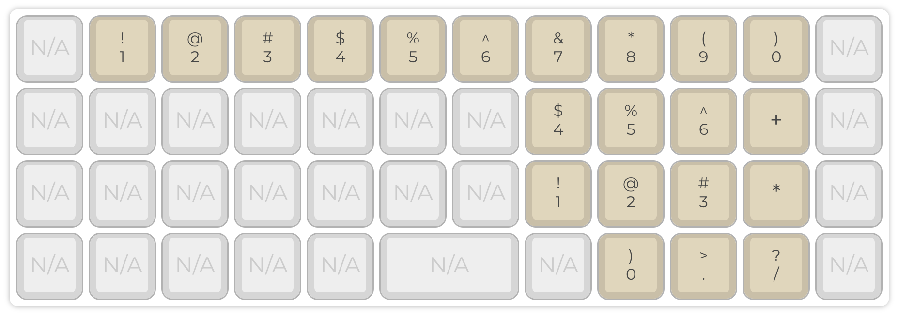
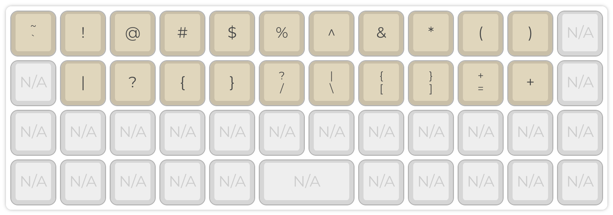
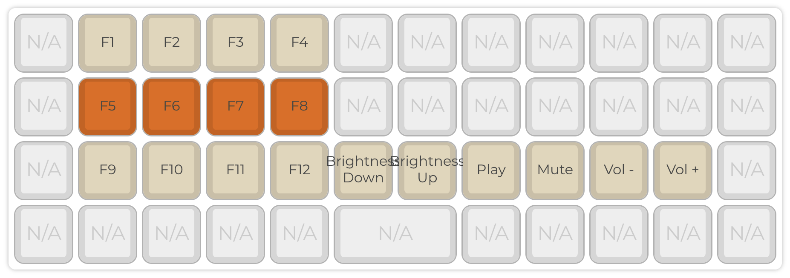

## Layout Ortholinear 40% có khó dùng không?

Ai chơi bàn phím cơ cũng thường thắc mắc layout 40% thì gõ phím thế nào, nó có
thực sự hữu dụng hay chỉ là layout cute để trưng keycap chụp ảnh là chính? Bản
thân mình từng thắc mắc vụ này nên cũng build 1 em 40% để trải nghiệm. Trong bài
này mình chỉ nói tới layout ortholinear 47 keys, sử dụng firmware QMK. Sở dĩ
mình nhắc tới QMK là vì 47 phím không đủ để gõ tất cả ký tự như bàn phím thông
thường, nên mình cần tính năng chia layer của QMK để có thể chuyển 47 phím vật
lý gõ được nhiều ký tự khác nhau tuỳ vào layer đang được kích hoạt.

Đôi điều về bàn phím mình build, mình dựa vào _**Planck Keyboard**_, mạch mình
tự thiết kế để có thể dùng được với mạch _**Black Pill**_ được bán sẵn, lý do
mình chọn Black Pill là vì dễ kiếm, và mình thích lập trình trên nền ARM hơn,
mình dự định viết firmware riêng cho bàn phím này. Về phần phím thì có 2 lựa
chọn, hoặc là toàn 1u với 48 phím, hoặc là 47 phím với space 2u. Mình thích
space 2u vì nó có điểm nhấn hơn và nhìn thân thuộc hơn. Vì sao lai chọn
ortholinear? Vì nó cân đối cho cả 2 tay, mạch dễ thiết kế, nhìn thẩm mỹ hơn, dễ
tìm keycap. Từ đây mình sẽ gọi bàn phím này là _**Mint**_.

Về cách mình gõ phím, mình gõ không nhanh nhưng gõ đúng 10 ngón, nghĩa là mình
luôn chia mỗi ngón tay quản lý 1 số phím nhất định. Ngón trỏ và ngón út sẽ quản
lý 2 cột, các ngón còn lại 1 cột. 2 ngón cái chia nhau space và 1 số modifier
lân cận. Lợi điểm của cách gõ này trên layout 40% là mình ko cần di chuyển tay
quá nhiều, số lượng phím ít nên có thể nhớ vị trí phím.

Giờ mình sẽ đi vào phần chính cách mình dùng _**Mint Keyboard**_ (bàn phím 40%
mình tự build) cho công viêc hàng ngày.

## Chat, message

Mình là lập trình viên nên phần lớn thời gian là code và chat, đặc điển công
viêc là vậy. Mình có đính kèm base layer mình đang dùng cho Mint, mình gõ Dvorak
nhưng nếu là Qwerty cũng ko khác mấy. Gõ văn bản thì hiếm khi cần chuyển layer,
vì trên base layer có đủ alpha với chấm, phẩy. Đủ dùng cho việc chat chit, đôi
khi cần gõ số thì mới chuyển layer. Minh sẽ nói về layer số sau, nhưng nhìn
chung nếu chỉ để chat thì Mint hoạt động tốt như các anh lớn.

## Gõ số và các phép toán

Đây là lúc bạn thấy sự tự do và lợi thế của ortholinear và QMK. Bạn nhìn hình
mình gán các phím số và phép toán cho layer _**lower**_, thật trùng hợp là mình
có thể mix giữa cách xếp số theo row và cách xếp theo _**ten keys**_ của Numpad.
Lúc này chỉ cần tay trái giữ lower là tay phải có thể gõ số thuận tiện như gõ ở
Numpad, bạn nào thích gõ hàng phím trên cùng cũng OK.

## Các ký tự đặc biệt còn lại và coding

Mình gần như chỉ dùng ký tự đặc biệt khi code, việc đầu tiên mình làm là xác
định tất cả ký tự đặc biệt sẽ nằm ở layer _**raise**_. Cụm ký tự đầu tiên mình
quan tâm là nhóm đi chung với phím số, mình giữ cụm này đúng với vị trí số hàng
trên cùng, vậy là khi lower mấy phím này sẽ từ 1-9-0, và khi raise sẽ là ký tự
đặc biệt tương ứng. Cách này giúp mình dễ nhớ do ko có thay đổi gì với bàn phím
thường. Những ký tự còn lại mình sẽ xếp vào row 2, ở đây mình có ưu tiên `{` và
`[` vào 2 vị trí thuận tiện của ngón trỏ vì mình lập trình Java sử dụng 2 dấu
này nhiều. Với mình đây là lợi thế rất lớn của Mint so với layout chuẩn, vì ở
layout chuẩn mấy dấu này nằm ở ngón út, yếu hơn nên sẽ dễ mỏi.

Vậy là với 3 layer, mình tự tin gõ thoải mái như ở layout nhiều phím hơn, thật
lòng mà nói nhấn giữ phím lower, raise dễ chịu hơn là nhấc tay khỏi home row ở
bàn phím lớn hơn. Nhưng mà khoan, vẫn còn thiếu gì đó?

## Function ở nơi đâu?

Thời COVID thì sao tránh khỏi F0, F1. Tổ hợp phím cũng vậy, lâu lâu vẫn cần tới
`F1`, `F12`. Lúc này mình sẽ cần thên 1 layer nữa cho phím `Fn`, layer này chịu
trách nhiệm cho các phím `F1`-`F12`, mình gán nó vào 1 cụm ở tay trái vì ko dùng
nhiều, ngoài function thì mình cũng gán 1 số phím chức năng hay dùng như mute
mic, mute speaker, volume up, volume down...rất tiện.

Như vậy là chỉ với 47 phím, mình hoàn toàn thoải mái gõ mọi thứ trong công việc,
10 tiếng mỗi ngày. Nhưng không phải là không có đánh đổi, trước khi nói tới phần
khó khăn, mình muốn nói tới 1 chức năng rất hay của QMK.

## Modifier - Tap

Như tên gọi, chức năng này cho phép bạn gán modifier và 1 keycode thông thường
vào cùng 1 phím, khi mình nhấn giữ thì nó là modifier, khi tap thì nó là keycode
thông thường. Mình tận dụng tính năng này cho 2 phím:

- **Right Shift - Enter**: vì phím Enter nằm ngay vị trí Right Shift, nên ko có
  lý do gì phải từ bỏ thói quen nhấn Right Shift cả, nó còn giúp mình hạn chế
  nhấn nhầm Enter vì tưởng là phím Shift.
- **Right Command - Left Arrow**: mình dùng MacOS nên thường dùng tổ hợp phím
  Command - Delete để xoá file, mình thường dùng Right Command cho tổ hợp phím
  này, rất hữu dụng.

## Vậy thì đâu là khó khăn khi dùng layout 40%

Mình nghĩ trở ngại đầu tiên là bạn ko muốn dùng, một khi đã không muốn thì mọi
khó khăn sẽ ko được giải quyết. Tinh thần chấp nhận và không so sánh là yếu tố
đầu tiên quyết định bạn có đi tiếp hay không. Thứ hai là về kỹ thuật và độ lỳ,
không phải ai cũng dành thời gian học cách compile QMK, config keymap, không
phải ai cũng ngồi suy nghĩ đặt phím sao cho hợp lý, rồi ngồi chậm rãi gõ cho
quen mặt phím. Cái cảm giác muốn gõ 1 phím mà ko biết nó nằm đâu, phải gõ ngón
nào cũng mệt tim lắm, mình từng vừa gõ vừa nín thở mấy ngày đầu. Khó khăn cuối
cùng có lẽ là sau khi cân đong đo đếm, công sức bỏ ra thấy không đáng với kết
quả nhận được, cái này thì tuỳ mỗi người đánh giá.

## Vì sao mình phải chịu khổ học layout 40% và ortholinear

Vì thiết kế bàn phím hiện tại đã lạc hậu, staggered keyboard ra đời để giải
quyết khó khăn của máy đánh chữ, khi thiết kế cơ khí ràng buộc phải làm thế.
Chúng ta làm quen với máy tính đa phần ko biết máy đánh chữ, nên ortholinear là
layout tốt hơn nhiều, chúng ta là nạn nhân của quá khứ, nhưng ai cũng có thể bấm
nút reset để học lại.

Vì đơn giản, ortholinear 40% rất đẹp, gọn, cân đối, thích hợp mang theo bất kỳ
đâu, nghĩa là ko cần lo làm quen với bàn phím mới, đi đâu cũng xài bàn phím của
mình. Lý do cuối là tiết kiệm, mạch 40% nhỏ gọn, ít linh kiện hơn nên build cũng
rẻ hơn nhiều so mới layout khác.

Trên đây là đôi điều hy vọng chúng ta có cái nhìn khác về 1 layout nổi tiếng chỉ
để trưng bày nhưng cũng thật sự hữu dụng.
